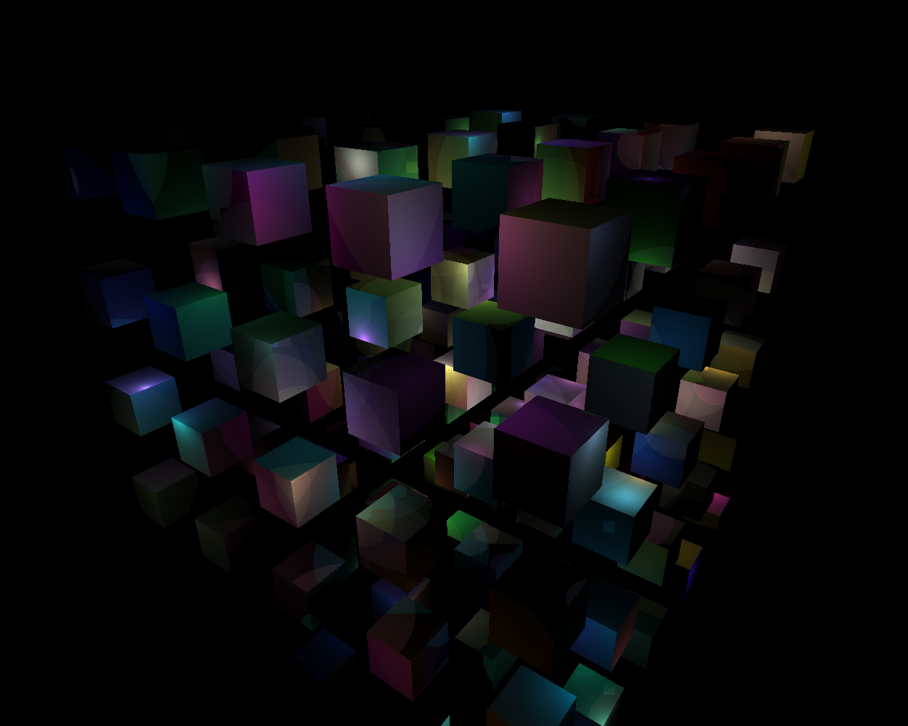
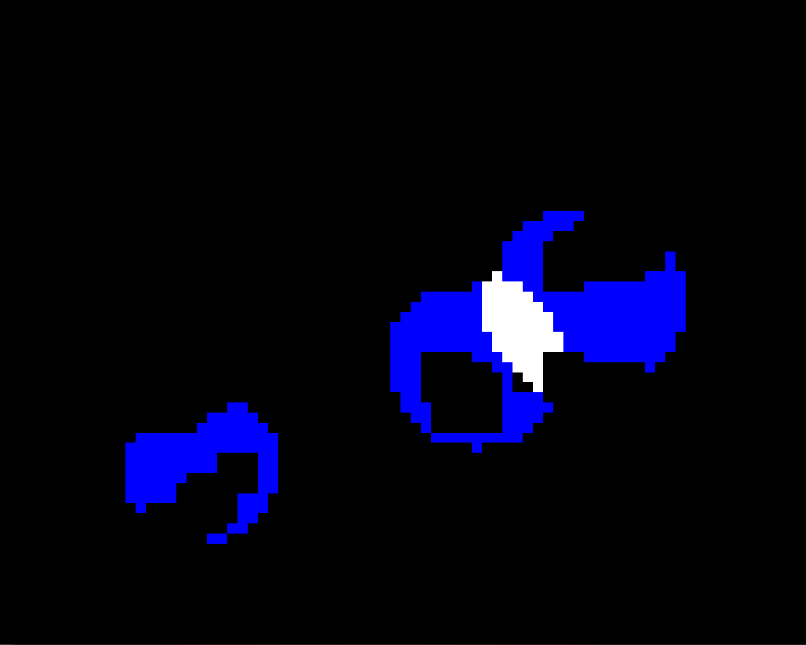
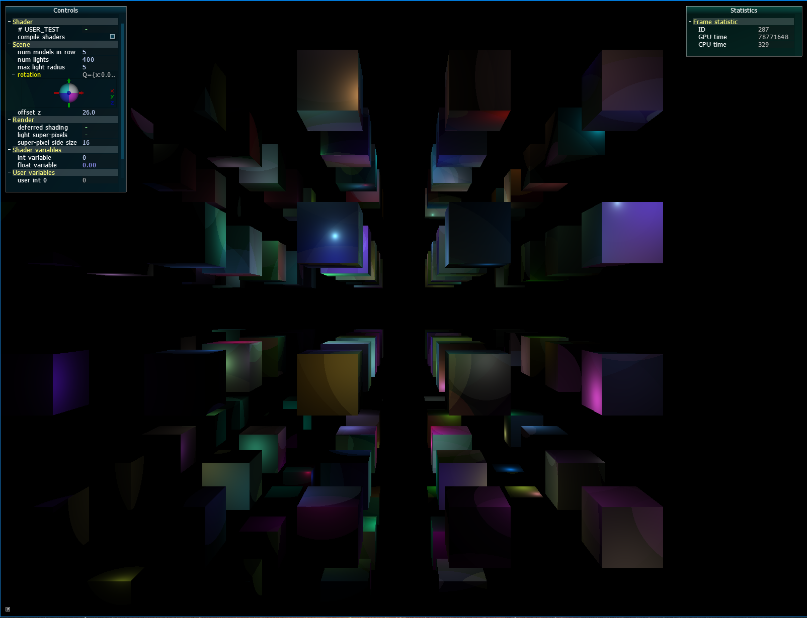
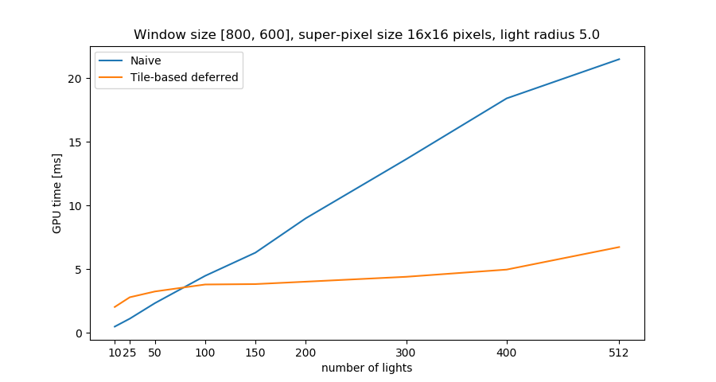

# Simple Tile-Based Deferred Shading

## Zadanie
Cieľom semestrálnej práce kurzu Programování grafiky 2 bolo naimplementovať techniku odloženého tieňovania (deferred shading) a metódu vylepšiť o filtrovanie svetelných zdrojov v jednotlivých častiach obrazu tak, aby sa do výpočtu zahrnul čo najmenší počet svetelných zdrojov (tile-based deffered shading).

## Popis implementácie
Predpokladáme, že máme scénu obsahujúcu veľké množstvo pohybyjúcich sa svetiel s rôznymi vlastnosťami ako sú farba a zoslabenie intenzity. Metóda odloženého tieňovania prebieha v niekoľkých krokoch:

V prvom kroku sa vykreslením scény bez svetiel získajú informácie o najbližších viditeľných povrchoch, ich normálach a hĺbke, ktoré sa zapíšu do textúr vytvoreného framebufferu (FBO).

V druhom kroku sa raster rozdelí na super-pixely (s veľkosťou zadanou užívateľom) a pre každý super-pixel sa vygeneruje zoznam svetiel ktoré ho ovplyňujú. Všetky výpočty prebiehajú na GPU. Super-pixely do ktorých svetlá zasahujú detekujem tak, že každé svetlo renderujem ako sféru s polomerom závislým na zoslabení svetla a super-pixel ktorý sa pri tomto zobrazovaní vykreslí zároveň pretína sféru a teda je svetlom ovplyvnený (Obrázok 2). Pre uloženie identifikátorov svetiel zasahujúcich do super-pixelu využívam vhodne usporiadaný shader storage buffer (SSBO), ktorý pre každý super-pixel obsahuje počet políčok rovný maximálnemu počtu svetiel. Nie všetky políčka ale musia byť využité. Ďalej využívam textúru, do ktorej pre každý super-pixel zapisujem počet svetiel, ktoré do neho zasahujú.

V poslednom kroku sa vykreslí obdĺžnik cez celú plochu okna a pre každý pixel sa spočíta zjednodušený Phongov osvetlovací model kombináciou informácií z FBO z prvého kroku a vyfiltrovaných svetiel z druhého kroku. Pre každý pixel spočítam do ktorého super-pixelu patrí a na základe týchto súradníc a textúry obsahujúcej pre každý super-pixel počet do neho zasahujúcich svetiel, som schopná v SSBO lokalizovať presné identifikátory svetiel ktoré záhrnúť do výpočtu. 

## Ovládanie
Na ovládanie programu slúži AntTweakBar v ktorom je možné prepínať medzi naivným a odloženým tieňovanám (deferred shading). Ďalej je možné meniť počet kociek a svetiel v scéne, a pre svetlá ich maximálny polomer (polomer sa náhodne generuje pre každé svetlo v rozsahu 1 až zadaný maximálny polomer). Počet svetiel je omedzený na maximálne 512. Ďalej možné meniť aj veľkosť strany super-pixelu (super-pixel side size).
Pridala som možnosť zobraziť super-pixely ovplyvňené svetlami (light super-pixels). Super-pixely vyplnené modrou farbou sú super-pixely do ktorých zasahuje iba jedno svetlo, naopak biele super-pixely sú tie do ktorých zasahuje viac svetiel.
Pre klávesové skratky viď správu po začatí programu. 

## Ukážky aplikácie

